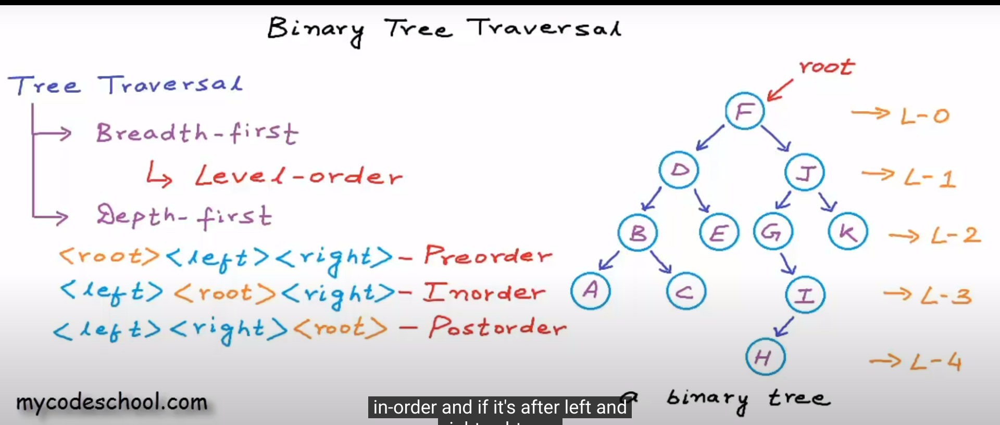

In Depth-first traversals, for eg in inorder traversal, left subtree is fully traversed (recursively) in depth first manner, then root node is printed, then right subtree is fully traversed (recursively) in depth first manner.

There can be more techniques, but these are the common ones. 

Convention is to first traverse left subtree then only traverse right subtree in these.

## To remember:

### Inorder (in the right order): left->root->right

### Preorder (pre means before other things): root->left->right

### Postorder(post means after other things): left->right->root

Notes: If we perform inorder on a bst, then we will get ascending order (sorted list)